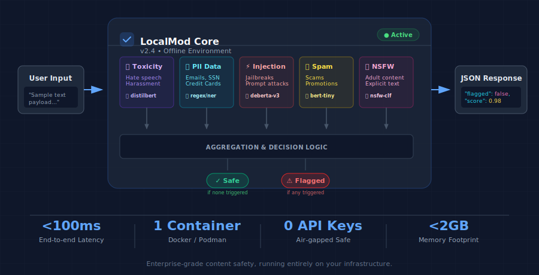

# LocalMod

[](https://www.python.org/downloads/)
[](https://opensource.org/licenses/MIT)
[]()
[]()

**Fully offline content moderation API** — Self-hosted content safety for teams who can't afford to send data to the cloud.

<p align="center">
  
</p>

---

## How It Works

```
┌─────────────┐      POST /analyze       ┌──────────────────────────────────────┐      JSON       ┌─────────────┐
│   Your App  │  ──────────────────────▶ │           LocalMod API               │ ──────────────▶ │  Response   │
│             │     "Check this text"    │  ┌─────┐ ┌────┐ ┌────┐ ┌────┐ ┌────┐ │                 │ flagged: T/F│
└─────────────┘                          │  │Toxic│ │PII │ │Jailb│ │Spam│ │NSFW│ │                 │ severity    │
                                         │  └─────┘ └────┘ └────┘ └────┘ └────┘ │                 │ confidence  │
                                         └──────────────────────────────────────┘                 └─────────────┘
                                                    Runs 100% Locally
```

## Why LocalMod?

| Feature | Benefit |
|---------|---------|
| 🔒 **100% Offline** | All models run locally, your data never leaves your infrastructure |
| ⚡ **Fast** | <100ms on CPU, <30ms on GPU |
| 🎯 **Comprehensive** | 5 classifiers: Toxicity, PII, Prompt Injection, Spam, NSFW |
| 🐳 **Docker Ready** | Single image deployment, works anywhere |
| 💰 **Cost Effective** | No per-request API fees, one-time setup |

## Quick Start

### 1. Install

```bash
pip install -e .
```

### 2. Download Models (first time only, requires internet)

```bash
python -m localmod.cli download
```

### 3. Use in Python

```python
from localmod import SafetyPipeline

pipeline = SafetyPipeline()

# Analyze text
report = pipeline.analyze("Hello, how are you?")
print(f"Flagged: {report.flagged}")  # False

# Detect PII
report = pipeline.analyze("My email is john@example.com")
print(f"Flagged: {report.flagged}")  # True
print(f"Severity: {report.severity}")  # medium
```

### 4. Or Run as API Server

```bash
# Start the server
python -m localmod.cli serve --port 8000

# Test it
curl -X POST http://localhost:8000/analyze \
  -H "Content-Type: application/json" \
  -d '{"text": "You are an idiot!", "classifiers": ["toxicity"]}'
```

### 5. Or Use Docker

```bash
docker build -f docker/Dockerfile -t localmod:latest .
docker run -p 8000:8000 localmod:latest
```

---

## Classifiers

| Classifier | Detects | Technology | Model |
|------------|---------|------------|-------|
| 🔥 **Toxicity** | Hate speech, harassment, threats | ML | DistilBERT |
| 🔒 **PII** | Emails, phones, SSNs, credit cards | Regex + Validation | None (deterministic) |
| ⚡ **Prompt Injection** | LLM jailbreaks, instruction override | Pattern + ML | DeBERTa |
| 📧 **Spam** | Promotional content, scams | Heuristics + ML | BERT-tiny |
| 🔞 **NSFW** | Sexual content, adult themes | ML | NSFW-classifier |

### PII Detection Details

Automatically detects and can redact:
- **Email addresses** — `john@example.com` → `[EMAIL]`
- **Phone numbers** — `555-123-4567` → `[PHONE]`
- **SSNs** — `123-45-6789` → `[SSN]` (with validation)
- **Credit Cards** — `4111-1111-1111-1111` → `[CREDIT_CARD]` (Luhn validated)
- **IP addresses** — `192.168.1.1` → `[IP_ADDRESS]`

```python
from localmod.classifiers.pii import PIIDetector

detector = PIIDetector()
detector.load()

text = "Email me at john@example.com or call 555-123-4567"
redacted, _ = detector.redact(text)
# Result: "Email me at [EMAIL] or call [PHONE]"
```

---

## API Endpoints

| Endpoint | Method | Description |
|----------|--------|-------------|
| `/health` | GET | Health check with loaded models |
| `/classifiers` | GET | List available classifiers |
| `/analyze` | POST | Analyze single text |
| `/analyze/batch` | POST | Analyze multiple texts |
| `/redact` | POST | Redact PII from text |

### Example Response

```json
{
  "flagged": true,
  "results": [
    {
      "classifier": "pii",
      "flagged": true,
      "confidence": 1.0,
      "severity": "medium",
      "categories": ["email"],
      "metadata": {"total_count": 1}
    }
  ],
  "summary": "Content flagged for: pii (medium): email",
  "processing_time_ms": 1.23
}
```

---

## Configuration

Set via environment variables (prefix with `LOCALMOD_`):

| Variable | Default | Description |
|----------|---------|-------------|
| `DEVICE` | `auto` | `cpu`, `cuda`, or `auto` |
| `LAZY_LOAD` | `true` | Load models on first request |
| `*_THRESHOLD` | `0.5` | Detection threshold per classifier |
| `MAX_TEXT_LENGTH` | `10000` | Maximum text length |

---

## Performance

| Metric | CPU | GPU |
|--------|-----|-----|
| Latency (p95) | <100ms | <30ms |
| Throughput | 20+ req/sec | 100+ req/sec |
| Memory | <2GB RAM | <4GB VRAM |

---

## Run Demo

```bash
python examples/demo.py
```

Sample output:
```
============================================================
LocalMod Demo - Content Moderation API
============================================================

[1] Initializing PII detector (no ML model needed)...
    ✓ PII detector ready

[2] Testing PII Detection...
    🚨 FLAGGED: "My email is john.doe@example.com..."
       Types: ['email']
    🚨 FLAGGED: "Call me at 555-123-4567..."
       Types: ['phone_us']
    ✅ Safe: "Hello, how are you today?..."

[3] Testing PII Redaction...
    Original:  Contact John at john@email.com or 555-123-4567
    Redacted:  Contact John at [EMAIL] or [PHONE]
```

---

## Development

```bash
# Install with dev dependencies
pip install -e ".[dev]"

# Run tests
pytest tests/ -v

# Run fast tests (PII only, no model downloads)
pytest tests/test_classifiers/test_pii.py -v
```

---

## License

MIT License — see [LICENSE](LICENSE) for details.

---

## Acknowledgments

Uses pre-trained models from [HuggingFace](https://huggingface.co/):
- `martin-ha/toxic-comment-model` (Toxicity)
- `protectai/deberta-v3-base-prompt-injection-v2` (Prompt Injection)
- `mrm8488/bert-tiny-finetuned-sms-spam-detection` (Spam)
- `michellejieli/NSFW_text_classifier` (NSFW)
